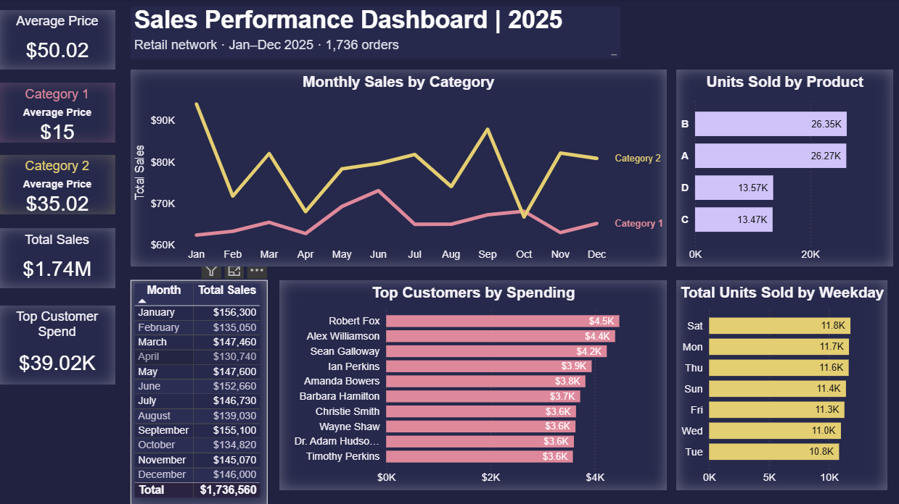

# retail-sales-analysis-2025

Retail sales analysis project based on 2025 retail sales data.

**Tools:** PostgreSQL, Power BI

## Dashboard

[View interactive dashboard on Power BI Public](#)

## Dataset
The dataset contains **10,000** transaction records for **2025**, including order, product, customer, quantity, price, category, and order date fields.

## Repository Structure
- `combined_sales_data.xlsx` — raw dataset
- `sql/01_data_quality_checks.sql` — data quality validation checks
- `sql/02_create_views.sql` — SQL views used for dashboarding
- `powerbi/dashboard_preview.png` — dashboard screenshot

## Business Problem
This case study examines a retail network with **10,000** sales transactions in 2025 and total revenue of **$1.74M**. Despite having data on sales, customers, and products, the business lacked a unified tool to track sales trends, compare category performance, identify top customers, monitor product demand, and understand weekly sales patterns.

## Project Goal
Prepare and validate data using PostgreSQL, then build analytical views for Power BI. Develop a dashboard that answers key business questions and creates a foundation for tracking performance over time as more historical data becomes available.

- How sales shift across categories throughout the year
- Who the top customers are by spending
- Which products sell best
- How average price differs by category
- Which weekdays drive the highest sales volume

## Key Findings
- **Category 2** generates **54.5%** of total revenue
- **January, June, and September** are the strongest months
- **Product B and Product A** lead in units sold
- **Saturday** is the most active day of the week

This tool supports data-driven decisions on assortment, inventory planning, and marketing.

## Recommendations
- **Increase focus on Category 2**  
  Category 2 is a key sales driver. This category deserves closer attention in terms of product availability, pricing strategy, and promotional activity.

- **Maintain strong availability of Product A and Product B**  
  These products are critical for stable demand and inventory planning.

- **Use the strongest months for promotions and planning**  
  January, June, and September are the strongest months. These periods can be used to scale campaigns and evaluate seasonal demand patterns.

- **Pay attention to weaker periods**  
  Weaker months such as April, October, and February may be good candidates for targeted promotions or assortment adjustments.

- **Use weekday patterns in operational planning**  
  Since Saturday shows the highest sales volume, this pattern can be considered in staffing, inventory allocation, and marketing activity.

## Limitations & Assumptions
- The analysis is based on sales data for **2025 only** and does not include prior-year comparison.
- The dataset does not contain **profit, margin, or cost** data, so the analysis focuses on revenue and sales volume only.
- **Returns, cancellations, and discounts** were not included in the dashboard logic.
- Recommendations are based only on the available fields in the dataset and should be treated as directional insights.

## Next Steps
- Extend the analysis with period-over-period comparison once data for additional years becomes available.
- Add customer segmentation or cohort analysis to better understand repeat purchase behavior.
- Expand the dashboard with return and profitability metrics if margin-related data is available.
